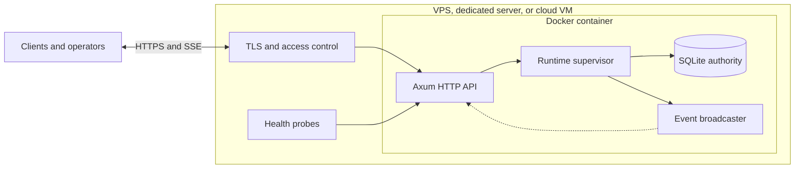

<div align="center">

# SCG Infrastructure

**A supervised Rust control-plane node for revisioned state, ordered events, and isolated runtime environments.**

[](https://github.com/VicoD3X/scg-infra-public/actions/workflows/ci.yml)


[Architecture](#architecture) · [Run](#run-the-node) · [HTTP contract](#http-contract) · [Configuration](#configuration) · [Security](SECURITY.md)

</div>

SCG rebuilds the control-plane architecture of a system running in production as a standalone Rust service. Operational data is replaced with deterministic test state; the runtime model, failure handling, and isolation rules remain intact.

The node exposes a compact HTTP contract over a supervised runtime. It keeps authoritative state in SQLite, emits ordered events over SSE, rejects stale writes, and separates live workloads from test scenarios at the storage boundary.

## Architecture



TLS and authentication stay at the deployment edge. The node owns runtime coordination, state integrity, event ordering, and recovery checkpoints.

The internal service graph starts in dependency order and stops in reverse order:

`ingress → policy → workers → projection` with `telemetry` attached independently to `ingress`.

## Runtime guarantees

| Concern | Implementation |
|---|---|
| Write consistency | One SQLite writer, `IMMEDIATE` transactions, and caller-supplied expected revisions |
| Event ordering | Monotonic sequence numbers committed beside each state revision |
| State integrity | SHA-256 checksum over realm, revision, operation, and canonical JSON state |
| Recovery | Persistent runtime checkpoints; an unclean restart reopens in `degraded` state before verification |
| Environment isolation | A database records its realm identity and refuses to open under another realm |
| Service lifecycle | Validated dependency graph, deterministic startup, reverse-order shutdown |
| API stability | Versioned JSON contracts and versioned SSE envelopes |
| Operations | Liveness, readiness, structured tracing, bounded history, and graceful shutdown |

## Run the node

Docker Compose starts the live realm on the loopback interface:

```bash
docker compose up --build
```

Check the node:

```bash
curl http://127.0.0.1:8080/healthz
curl http://127.0.0.1:8080/readyz
```

You can also run it with Cargo:

```bash
cargo run --package scg-node -- config/node.example.toml
```

## Commit state

Every write includes the revision observed by the caller. A stale revision returns `409 Conflict` instead of overwriting newer state.

```bash
curl --request POST http://127.0.0.1:8080/v1/state/commit \
  --header 'content-type: application/json' \
  --data '{
    "expectedRevision": 0,
    "operation": "capacity.updated",
    "state": {
      "workerLimit": 8,
      "queueLimit": 256
    }
  }'
```

Subscribe to the ordered event stream:

```bash
curl --no-buffer http://127.0.0.1:8080/v1/events
```

## HTTP contract

| Method | Route | Purpose |
|---|---|---|
| `GET` | `/healthz` | Process liveness and contract version |
| `GET` | `/readyz` | Runtime, service, and storage readiness |
| `GET` | `/v1/snapshot` | Current revision, state, realm, and service status |
| `GET` | `/v1/events` | Server-Sent Events stream with ordered envelopes |
| `POST` | `/v1/state/commit` | Revision-checked state commit |
| `POST` | `/v1/runtime/start` | Start or recover the supervised service graph |
| `POST` | `/v1/runtime/stop` | Stop services and persist a clean checkpoint |

## Configuration

Configuration can come from a TOML file or environment variables. Environment variables take precedence.

| Environment variable | Default | Description |
|---|---:|---|
| `SCG_BIND` | `127.0.0.1:8080` | HTTP listen address |
| `SCG_DATA_DIR` | `./var/scg` | Directory containing realm databases |
| `SCG_REALM` | `live` | `live` or `lab:<identifier>` |
| `SCG_EVENT_RETENTION` | `1000` | Maximum retained event records |
| `SCG_SNAPSHOT_RETENTION` | `20` | Maximum retained state snapshots |
| `RUST_LOG` | service defaults | Tracing filter |

A lab run creates its own database and cannot reuse the live database:

```bash
SCG_REALM=lab:failure-injection cargo run --package scg-node
```

## Repository layout

```text
crates/
├── scg-core/   runtime lifecycle, service graph, contracts, SQLite store
├── scg-api/    Axum routes, SSE adapter, HTTP error mapping
└── scg-node/   configuration, process lifecycle, graceful shutdown
```

## Verification

```bash
cargo fmt --all --check
cargo clippy --workspace --all-targets --all-features -- -D warnings
cargo test --workspace --all-targets --all-features
```

The test suite covers dependency ordering, revision conflicts, realm ownership, clean restarts, unclean recovery, HTTP health checks, and stale-write responses. CI runs the same checks on every pull request and every push to `main`.

## Deployment boundary

The Compose port is bound to `127.0.0.1`. If the API must leave the host, route it through an authenticated TLS proxy and keep the database volume private to the node. Live and lab realms should use separate processes, data directories, and deployment credentials.
